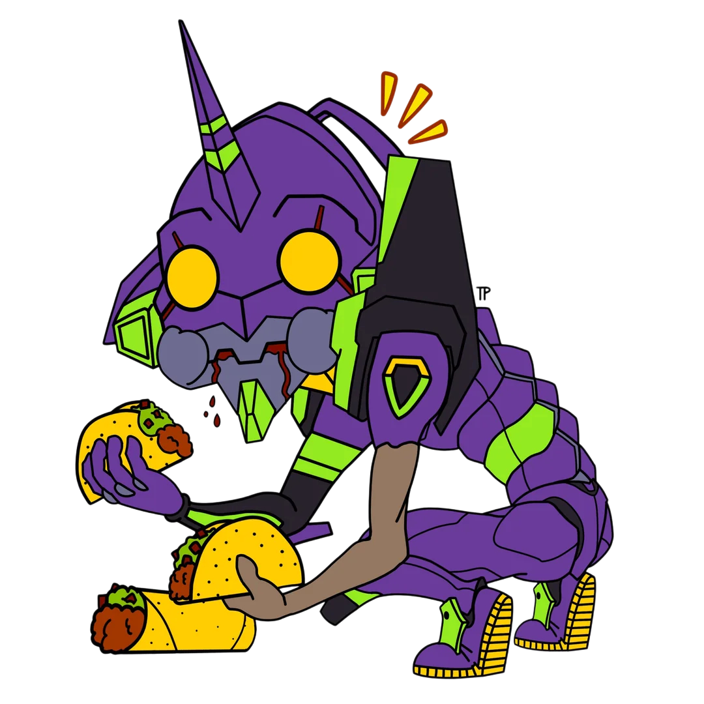
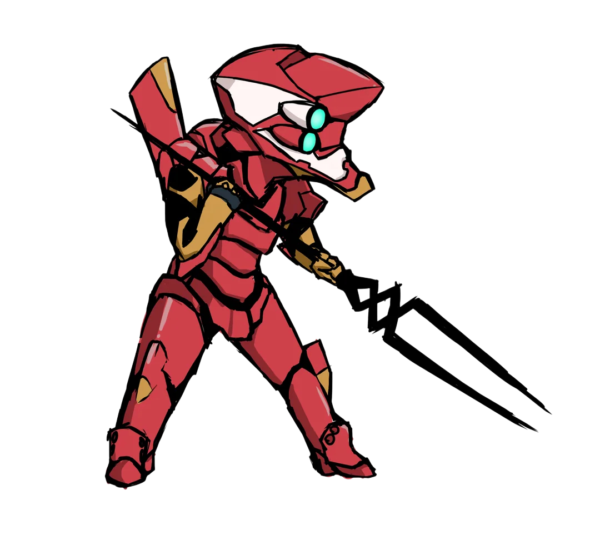

<div align="center">
    <a href="https://github.com/kawarimidoll/typograssy">
        
    </a>

</div>

<br>
<div align="center">
    <a href="https://github.com/DrTableBasse">
        
    </a>
</div>

        

<br>

<h2 align="center"> 👁️ About me 👁️ </h2>

```zsh
samuel@eva01: ~/my_readme (main⚡)$ fastfetch
```


```csharp
My Profile ver. 6.0.0: 何も真実ではなく、すべてが許されているのでございます。
----------------------------------------------------------------------------------------
Username: DrTableBasse
WhoamI: Pentester. Programmer. Anime lover. Gamer.
OS: Ubuntu 24.04 LTS x86_64 with GNOME
Fav.Anime(1): 新世紀エヴァンゲリオン (Neon Genesis Evangelion)
Fav.Anime(2): 機動戦士ガンダムウィングス00 (Mobile Suit Gundam Wings 00) 
Pronouns: He/Him (彼/彼の)
Languages: C, Python, JavaScript, HTML, CSS, Bash, Shell Script, ASM (x86 & ARM) 💀 
Learning: Pentest Web / Mobile / AI
Hobbies: Programming, Watching anime, Playing videogames, Reading manga, Listening music, Learning new things. Make My HomeLab.

```


<div>
    <br>
    <br>
    <br>
    <br>
    <table align="right" style="border: none; border-collapse: collapse;">
        <tr>
            <td style="vertical-align: middle; border: none; padding: 0;">
                <b> You are (not) alone</b><br>
                <i style="font-size: 0.9em;">— Shinji Ikari</i><br>
                <small>"I mustn't run away..."</small>
            </td>
            <td style="border: none; padding: 0;">
                <a href = "img/Evangelion/eva01.png">
                    
                </a>
            </td>
        </tr>
    </table>
    <br>
    <br>
    <table align="left" style="border: none; border-collapse: collapse;">
        <tr>
            <td style="border: none; padding: 0;">
                <a href = "img/Evangelion/eva02.png">
                    
                </a>
            </td>
            <td style="vertical-align: middle; border: none; padding: 0;">
                <b> You can (not) advance</b><br>
                <i style="font-size: 0.9em;">— Asuka Langley Soryu</i><br>
                <small>"Anta baka? I'm the best!"</small>
            </td>
        </tr>
    </table>
    <br>
    <br>
    <table align="right" style="border: none; border-collapse: collapse;">
        <tr>
            <td style="vertical-align: middle; border: none; padding: 0;">
                <b> You can (not) redo</b><br>
                <i style="font-size: 0.9em;">— Rei Ayanami</i><br>
                <small>"I am me. I am here."</small>
            </td>
            <td style="border: none; padding: 0;">
                <a href = "img/Evangelion/eva00.png">
                    
                </a>
            </td>
        </tr>
    </table>
    <br>

</div>
<br>
<br>
<br><br>
<br>
<br><br>
<br>
<br><br>
<br>
<br>


<div>
    <h2 align="center"> 🔎About me📖 </h2>
</div>
<div align = "center">
    <p align = "justify">
        I have been passionate about cybersecurity for many years, constantly seeking to deepen my knowledge and skills in this ever-evolving field. My dedication drives me to work tirelessly day and night, building and maintaining a comprehensive homelab for my team. This infrastructure serves as our training ground, allowing us to practice, experiment, and continuously improve our cybersecurity capabilities in a safe and controlled environment.
    </p>
    <p align = "justify">
        I actively participate in cybersecurity conventions and conferences across France, including GreHack, THCON, LEHACK, BARBHACK, and many others. These events provide invaluable opportunities to network with fellow security professionals, learn about the latest threats and defense techniques, and stay at the forefront of cybersecurity innovation.
    </p>
    <p align = "justify">
        In terms of programming, I have strong expertise in Python, C, C#, JavaScript, and ASM x86-64. These languages form the foundation of my technical skills, enabling me to develop security tools, analyze vulnerabilities, and create robust solutions for various cybersecurity challenges. Additionally, I have deep knowledge in networking fundamentals and the OSI (Open Systems Interconnection) model, understanding each layer from the physical layer to the application layer. This comprehensive understanding of network architecture allows me to effectively analyze network traffic, identify security vulnerabilities at different protocol levels, and design secure network infrastructures.
    </p>
    <p align = "justify">
        Beyond my technical pursuits, I have a deep interest in mentoring and teaching. Sharing knowledge and helping others grow in the cybersecurity field is not just a hobby for me—it's a true passion. I believe that education and mentorship are essential for building a stronger, more skilled cybersecurity community, and I am committed to contributing to this mission.
    </p>
    <p align = "justify">
        In addition, I enjoy Japanese culture and I am a big fan of anime, which complements my interest in languages and technology.
        <br>
    </p>
    <br>
    <h2 align="center"> 💻 I've Worked With  </h2>
    <p align = "center">
         <a href="https://skillicons.dev">
             
        </a>
    </p>
    <h2 align="center"> 🛠️ I'm still learning or working on  </h2>
    <p align = "center">
         <a href="https://skillicons.dev">
             
        </a>
    </p>
</div>
<br>
<br>
<br>


<h2 align = "center"> 📉 GitHub Stats</h2>
<div> 
    <p align = "center">
<!--         <a href="https://github-readme-stats.vercel.app">
            
        </a> -->
      <!--change language to japanese locale=jp-->
<!--         <a href="https://github.com/ryo-ma/github-profile-trophy">
            
            
        </a> -->
        <a href="https://github.com/vn7n24fzkq/github-profile-summary-cards">
            
    </p>
</div>
<br>
<br>

<h2 align ="center"> 📝 Contact me 📝</h2>
<br> 
<div align="center">
    <a href="https://www.linkedin.com/in/samuel-nuez-5a03771a8/" target="_blank">
        
    </a>
    <br>
</div>  
<br>

<div align="center">
    <a href="https://github.com/DrTableBasse">
        
    </a>
</div>